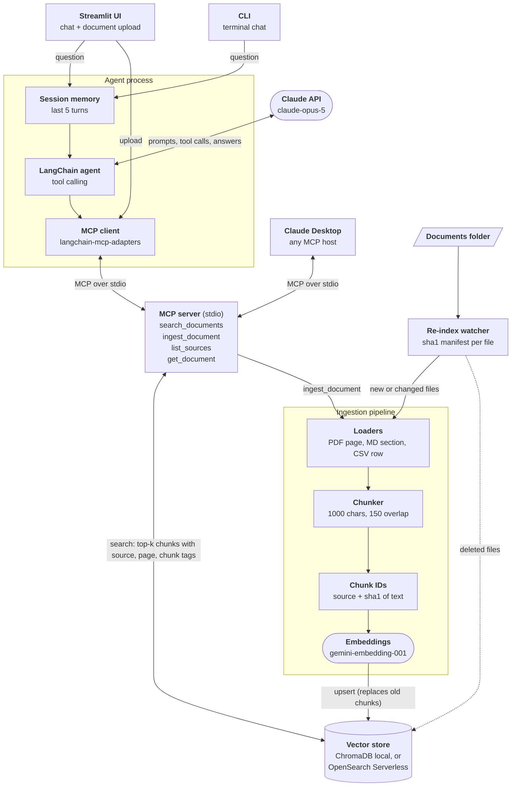

# AI Agent & RAG Automation System

A retrieval-augmented generation (RAG) agent for internal knowledge bases.
It ingests PDFs, Markdown, and CSV files, chunks and embeds them into a
vector store, and answers questions through a conversational Claude agent
that cites the exact passages it used and says so when the documents do
not contain the answer.

Built by [Abdulmajeed Taboo](https://www.linkedin.com/in/abdultaboo/).
Project page: [abdultaboo.netlify.app](https://abdultaboo.netlify.app)

## What it does

- **Ingests** PDF (one document per page), Markdown (one per heading
  section), CSV (one per row), and TXT, keeping page, section, and row
  numbers as metadata.
- **Chunks** with LangChain's `RecursiveCharacterTextSplitter`
  (1000 characters, 150 overlap).
- **Embeds** with Google `gemini-embedding-001` into a vector store:
  local ChromaDB by default, or an **AWS OpenSearch Serverless** vector
  collection with `VECTOR_BACKEND=opensearch`.
- **Answers** through a LangChain tool-calling agent on the **Claude API**
  (`claude-opus-5` by default, set with `AGENT_MODEL`).
- **Exposes its tools over MCP** (Model Context Protocol): the agent gets
  `search_documents`, `list_sources`, and `get_document` from an MCP server
  through an MCP client, and the same server plugs into Claude Desktop.
- **Cites** every claim with `[source: file, page N]` tags, shown in the UI
  as chips built from what retrieval actually returned.
- **Remembers** the last 5 turns per session for follow-up questions.
- **Uploads** new documents from the Streamlit sidebar.
- **Re-indexes automatically**: a watcher re-ingests new or edited files
  and removes deleted ones, without re-embedding unchanged files.

---

## Architecture



The same diagram as Mermaid source (also in
[`docs/architecture.mmd`](docs/architecture.mmd)).



**Request path.** A question goes into the session (which adds the last 5
turns), then to the LangChain agent. The agent sends the conversation and
its tool list to Claude. When Claude asks for a tool, the agent's MCP client
calls the MCP server, which embeds the query, pulls the top 4 chunks from
the vector store, and returns them with their citation tags. Claude writes
the answer from those passages only, with inline source tags, and the UI
turns the tags into citation chips.

**Ingestion path.** Streamlit uploads go through the `ingest_document` MCP
tool, and the re-index watcher calls the same `ingest_file` function: load,
chunk, hash, embed, and upsert. Before upserting, the file's old chunks are deleted
so an edited document can never be cited in its old form.

---

## Design decisions

### Why this vector store

The code talks to one small interface (`add_chunks`, `similarity_search`,
`list_sources`, `get_source_chunks`, `delete_source`, `reset_store` in
[`src/vectorstore/store.py`](src/vectorstore/store.py)) with two backends
behind it:

- **ChromaDB** for local development and the demo: no infrastructure, no
  cost, one folder on disk.
- **AWS OpenSearch Serverless** for an AWS deployment
  ([`opensearch_backend.py`](src/vectorstore/opensearch_backend.py)):
  managed, IAM-authenticated (SigV4), no cluster to size, and it combines
  k-NN vector search with metadata filters and keyword search in one engine,
  which is the path to hybrid retrieval later. It targets **NextGen**
  vector collections, which accept our own document IDs (so re-ingestion
  stays idempotent) and scale to zero when idle.

Tradeoffs considered: pgvector on RDS is cheaper at small scale but is a
database you run and tune yourself; Pinecone is simple but lives outside
the AWS account and its IAM controls; Bedrock Knowledge Bases hides chunking
and citation metadata that this project wants to control. OpenSearch
Serverless Classic collections also bill a minimum OCU floor even when idle
(see the cost model), which is why the demo runs on Chroma.

### Chunk size and overlap

Loaders split on document structure first (PDF page, Markdown heading, CSV
row), so most chunks are one complete section. Only sections longer than
1000 characters (about 250 tokens) are split further, preferring paragraph,
then line, then sentence boundaries. On the sample documents this gives 42
chunks averaging about 370 characters.

- **1000 characters** keeps each passage about one idea, so the top 4
  results are precise and the retrieved context stays near 1,000 tokens per
  search, which keeps Claude input cost low.
- **150 characters of overlap (15%)** means a sentence that straddles a
  split point still appears whole in at least one chunk.
- Tradeoff: small chunks can lose surrounding context. For questions about
  a whole document the agent has a `get_document` tool that returns every
  chunk of one file in order.

### How citations stay tied to source passages

1. Metadata is attached at load time (file name, page, section heading,
   row) and copied onto every chunk along with a `chunk_index`.
2. It is stored next to the vector, so every search hit comes back with it.
3. The retriever prints each passage under a header such as
   `[source=it_password_reset.pdf, page=2, chunk=4]`, so the model sees
   exactly which file and page each sentence came from.
4. The system prompt requires an inline `[source: ...]` tag per claim,
   forbids citing anything not retrieved in the current turn, and requires
   "I couldn't find that in the company knowledge base" when retrieval is
   empty.
5. The UI builds citation chips by parsing the **tool output**, not the
   model's prose, so a chip always points at a passage that was actually
   retrieved.
6. Chunk IDs are `source::sha1(text)`, and re-ingesting a file deletes its
   old chunks first, so no citation can point at text that has since
   changed.

Remaining risk: the model can still attach a tag to the wrong retrieved
passage. `scripts/evaluate.py` scores faithfulness with an LLM judge to
measure this. Claude's native Citations feature (document blocks with
character-level spans) is the next step if stricter guarantees are needed.

### Other tradeoffs

- **An agent instead of a fixed retrieve-then-answer chain.** Claude picks
  between search, listing documents, and reading a whole document. This
  handles "what documents do you have?" and summaries well, but costs one
  extra model round trip per tool call.
- **Sliding-window memory (5 turns)** keeps follow-ups like "what if that
  doesn't work?" working while capping input tokens per question.
- **Gemini embeddings on the free tier** cost nothing but are limited to
  100 embedding requests per minute, which caps how fast large uploads can
  be indexed. A paid tier or a different embedding model removes the limit.

---

## MCP integration

The retrieval layer is an MCP server built with the official
[MCP Python SDK](https://github.com/modelcontextprotocol/python-sdk)
([`src/mcp_server.py`](src/mcp_server.py)). The LangChain agent is an MCP
client ([`src/agent/mcp_client.py`](src/agent/mcp_client.py)): it launches
the server over stdio, loads its tools with
[`langchain-mcp-adapters`](https://github.com/langchain-ai/langchain-mcp-adapters),
and never imports the retrieval code directly.

| Tool | What it does | Given to the chat agent |
|---|---|---|
| `search_documents(query, source_filter?, k?)` | Top-k passages, each tagged `[source=..., page=..., chunk=...]` | Yes |
| `list_sources()` | File names currently indexed | Yes |
| `get_document(source)` | Every chunk of one file, in order | Yes |
| `ingest_document(path)` | Index or re-index a file inside `data/` | No (MCP hosts and the upload UI only) |

Design choices:

- **The MCP server is the only process that touches the vector store.** The
  agent, the Streamlit upload, and Claude Desktop all go through it, so there
  is one writer and one place to add auth, logging, or rate limits.
- **Least privilege.** The chat agent gets the three read tools only. Text
  planted inside a document cannot make it index new files.
- **Path sandbox.** `ingest_document` only accepts supported file types
  inside `RAG_DOCS_DIR` (default `data/`), so a model cannot be talked into
  indexing `.env` or other files on the machine.
- **One long-lived session.** MCP tools are async and tied to the event loop
  that opened the session, so the client runs that loop on a background
  thread and the synchronous UI submits work to it. The server starts once
  per app process, not once per question.

### Proof it works end to end

```bash
python scripts/demo_mcp_e2e.py "How do I reset my password if I lost my MFA device?"
```

Output from a real run (full text in
[`docs/evidence/mcp_e2e_run.txt`](docs/evidence/mcp_e2e_run.txt)):

```
Server tools: ['search_documents', 'list_sources', 'get_document', 'ingest_document']
Agent tools : ['search_documents', 'list_sources', 'get_document'] (read-only subset)
MCP tool call 1: search_documents({"query": "password reset lost MFA device"})
MCP tool call 2: search_documents({"query": "MFA token replacement enrollment procedure"})
Citations returned by search_documents:
  [source=it_password_reset.pdf, page=1, chunk=1]
  [source=it_password_reset.pdf, page=2, chunk=2]
  ...
ANSWER: Recovery when locked out of MFA, if you've lost your MFA device and
can't access email [source: it_password_reset.pdf, page 2]: ...
```

`tests/test_mcp_server.py` drives the server through a real MCP client
session (in-memory transport), including the path sandbox, and
`tests/test_agent.py` runs the full question, MCP tool call, cited answer
path against the live APIs.

### Test with the MCP Inspector

```bash
# Web UI (opens a browser)
npx @modelcontextprotocol/inspector .venv/Scripts/python src/mcp_server.py

# CLI mode
npx @modelcontextprotocol/inspector --cli .venv/Scripts/python src/mcp_server.py --method tools/list
npx @modelcontextprotocol/inspector --cli .venv/Scripts/python src/mcp_server.py --method tools/call --tool-name search_documents --tool-arg "query=expense deadline"
```

On macOS or Linux use `.venv/bin/python`. Saved Inspector output is in
[`docs/evidence/`](docs/evidence/).

### Connect to Claude Desktop

1. Ingest documents first: `python scripts/ingest.py --src data/sample_docs`.
2. In Claude Desktop open Settings, Developer, Edit Config, and add the
   server to `claude_desktop_config.json` with absolute paths:

   ```json
   {
     "mcpServers": {
       "rag-knowledge-base": {
         "command": "C:\\path\\to\\rag-agent-system\\.venv\\Scripts\\python.exe",
         "args": ["C:\\path\\to\\rag-agent-system\\src\\mcp_server.py"]
       }
     }
   }
   ```

   On macOS use `"command": "/path/to/rag-agent-system/.venv/bin/python"` and
   `"args": ["/path/to/rag-agent-system/src/mcp_server.py"]`.
3. Restart Claude Desktop. The four tools appear in the tools menu. Try:
   "Search my knowledge base for the expense submission deadline."

The server reads `GOOGLE_API_KEY` from the project's `.env`, so no key goes
in the Claude Desktop config. With the local Chroma backend, point either
Claude Desktop or the Streamlit app at the index, not both at once: Chroma
is not built for two processes writing the same folder. The OpenSearch
backend does not have this limit.

---

## Cost model

Monthly cost at three usage levels, generated by
[`cost_model.py`](cost_model.py) (`python cost_model.py` reprints it). Prices
come from the official Anthropic, Google, and AWS pricing pages (links at the
end). Claude tokens per question were measured on the running agent with
[`scripts/measure_tokens.py`](scripts/measure_tokens.py), not guessed.

**The short version:** Claude tokens are 78% to 94% of the bill at team and
department scale, so model choice and context size are the main levers.
Moving from `claude-opus-5` to `claude-sonnet-5` cuts the model bill by about
60%. The one exception is a low-traffic demo: an always-on OpenSearch
Serverless Classic collection has a 1 OCU floor (about $175/month) that would
cost more than the demo's Claude traffic, so the demo runs on Chroma.

<!-- cost-model:start -->
_Prices checked 2026-09-28. Default agent model: claude-opus-5._

#### Assumptions

| | Demo | Small team | Department |
|---|---:|---:|---:|
| Questions per day | 50 | 1,000 | 10,000 |
| Questions per month | 1,500 | 30,000 | 300,000 |
| Claude input tokens per question (measured) | 5,961 | 5,961 | 5,961 |
| Claude output tokens per question (measured) | 730 | 730 | 730 |
| Chunks retrieved per search / searches per question | 4 / 1.6 | 4 / 1.6 | 4 / 1.6 |
| Documents ingested per month | 20 | 500 | 5,000 |
| Chunks in the index | 2,000 | 100,000 | 1,000,000 |
| Hosting | Streamlit Community Cloud | 1 x Fargate 1 vCPU / 2 GB + ALB | 2 x Fargate 2 vCPU / 4 GB + ALB |
| Vector store | Chroma in the app | OpenSearch Serverless, 2 OCU | OpenSearch Serverless, 4 OCU |

#### Monthly cost by tier

| Line item | Demo | Small team | Department |
|---|---:|---:|---:|
| Claude tokens | $72.08 | $1,442 | $14,416 |
| Embeddings | $0.03 | $0.67 | $6.66 |
| Vector store | $0.00 | $350 | $701 |
| Hosting | $0.00 | $58.31 | $172 |
| S3 + Lambda ingest | $0.00 | $0.39 | $3.87 |
| **Total per month** | **$72.11** | **$1,851** | **$15,300** |
| Cost per question | $0.048 | $0.062 | $0.051 |

#### Claude cost by model (the biggest lever)

| Model | Per question | Demo | Small team | Department |
|---|---:|---:|---:|---:|
| claude-opus-5 | $0.0481 | $72.08 | $1,442 | $14,416 |
| claude-sonnet-5 | $0.0192 | $28.83 | $577 | $5,767 |
| claude-haiku-4-5 | $0.0096 | $14.42 | $288 | $2,883 |

#### Vector store options

| Option | Demo | Small team | Department |
|---|---:|---:|---:|
| Chroma (self-hosted) | $0.00 | $0.00 | $0.00 |
| OpenSearch Classic, no standby (1 OCU floor) | $175 | $175 | $351 |
| OpenSearch Classic, standby replicas (2 OCU floor) | $350 | $350 | $701 |
| OpenSearch NextGen (scale to zero) | $28.80 | $173 | $691 |

#### Biggest cost driver and how to cut it

- **Demo**: Claude tokens (100% of $72.11). If the demo ran on OpenSearch Classic instead of Chroma, the OCU floor ($175) would be the biggest line.
  - Keep the demo on Chroma: an always-on OpenSearch Classic collection would cost about $175/month (1 OCU dev-test floor) to serve $70 of Claude traffic.
  - Cap spend with a per-session question limit and a monthly spend limit in the Claude Console.
- **Small team**: Claude tokens (78% of $1,851).
  - Switch the agent to claude-sonnet-5: same code, one env var, about 60% less per question. Validate with scripts/evaluate.py before switching.
  - Cache the stable prefix (system prompt + tool definitions) and trim retrieved context (k=4 to k=3, shorter chunks) to cut the ~6,000 input tokens per question.
- **Department**: Claude tokens (94% of $15,300).
  - Route by difficulty: claude-haiku-4-5 for lookups and listings, a larger model only for multi-document questions.
  - Retrieve before the first model call instead of letting the agent loop: the measured average of 1.6 searches per question means extra round trips that resend the whole context.

#### Notes

- OpenSearch Classic collections bill at least 2 OCUs with standby replicas, or 1 OCU (0.5 indexing + 0.5 search) in dev-test mode, even when idle. NextGen collections scale to zero after 10 minutes idle; AWS does not publish the OCU count while warm, so the NextGen row uses the OCU assumption in `TIERS`.
- OCU counts for the team and department tiers are sizing assumptions to confirm with a load test. At 3,072 dimensions a million chunks is about 14 GB of vectors; cutting to 768 dimensions (supported by gemini-embedding-001) shrinks that 4x.
- Hosting, S3, and Lambda rows are the planned AWS deployment, not something running today. Lambda is shown before its monthly free tier (1M requests, 400,000 GB-seconds).
- gemini-embedding-001 is priced at $0.15/M tokens per Google's GA announcement; the current pricing page lists only gemini-embedding-2 ($0.20/M). Either way embeddings stay under 1% of the total.
- Claude 4.7 and later models use a tokenizer that produces about 30% more tokens for the same text than Haiku 4.5, so the Haiku row slightly overstates its cost.

#### Sources

- claude: https://platform.claude.com/docs/en/about-claude/pricing
- gemini_embed: https://developers.googleblog.com/gemini-embedding-available-gemini-api/
- gemini_pricing: https://ai.google.dev/gemini-api/docs/pricing
- opensearch: https://aws.amazon.com/opensearch-service/pricing/
- fargate: https://aws.amazon.com/fargate/pricing/
- alb: https://aws.amazon.com/elasticloadbalancing/pricing/
- s3: https://aws.amazon.com/s3/pricing/
- lambda: https://aws.amazon.com/lambda/pricing/
<!-- cost-model:end -->

---

## Live demo

**Demo:** https://abdultaboo-rag-agent.streamlit.app

Runs on Streamlit Community Cloud with the local Chroma backend and four
fictional sample documents. It uses the same agent, MCP server, and citation
path as the code in this repo. The first visit after a quiet period can take
about 30 seconds while the app wakes up. A recorded walkthrough script is in
[`docs/demo_walkthrough.md`](docs/demo_walkthrough.md).

### Why this setup

An always-on OpenSearch Serverless Classic collection bills a 1 OCU floor,
about $175 a month, before a single question. For a demo with a few dozen
questions a day that is more than the Claude traffic itself (see the cost
model), so the public demo runs on Chroma inside the app. Fixed hosting cost
is $0; the only variable cost is Claude, about $0.05 per question on
`claude-opus-5`.

### Guardrails (`DEMO_MODE=true`)

- **Per session:** 10 questions, 5 seconds between questions, 500 characters
  per question, 2 uploads of up to 300 KB.
- **Per day:** 150 questions across all visitors.
- **Hard spend cap:** a monthly spend limit on the Anthropic API key, set in
  the Anthropic Console, which holds even if the app restarts and its
  counters reset.
- **Uploads** are prefixed `upload_`, cannot overwrite the sample documents,
  and are deleted from the index after 30 minutes through the
  `delete_document` MCP tool, which can only remove uploads.
- **Keys stay server side** in Streamlit secrets. The Claude key is not
  passed to the MCP server process at all.

All limits are configurable in secrets (see
[`.streamlit/secrets.toml.example`](.streamlit/secrets.toml.example)) and
covered by `tests/test_demo_limits.py`.

### Deploy your own copy (Streamlit Community Cloud)

1. Create a separate Anthropic API key for the demo, and in the Anthropic
   Console set a monthly spend limit for the workspace (for example $20).
2. Go to [share.streamlit.io](https://share.streamlit.io), sign in with
   GitHub, and click **Create app**, then **Deploy a public app from GitHub**.
3. Repository `Majody21/rag-agent-system`, branch `main`, main file
   `app/streamlit_app.py`. Under **App URL**, choose
   `abdultaboo-rag-agent`.
4. Open **Advanced settings**, pick Python 3.11, and paste the contents of
   `.streamlit/secrets.toml.example` into **Secrets** with your real keys.
5. Click **Deploy**. On first start the app launches the MCP server and
   indexes the sample documents (about a minute).

---

## Quickstart

```bash
git clone https://github.com/Majody21/rag-agent-system.git
cd rag-agent-system
python -m venv .venv
# Windows: .venv\Scripts\activate    macOS/Linux: source .venv/bin/activate
pip install -r requirements.txt
cp .env.example .env    # then add ANTHROPIC_API_KEY and GOOGLE_API_KEY
```

Ingest the sample documents and ask questions:

```bash
python scripts/ingest.py --src data/sample_docs
python -m app.cli                      # terminal chat
streamlit run app/streamlit_app.py     # web UI with upload
```

Automated re-indexing (watches a folder, re-indexes only what changed):

```bash
python scripts/reindex.py --src data/sample_docs --watch --interval 30
```

Full rebuild after changing the embedding model or chunk size:

```bash
python scripts/reindex.py --src data/sample_docs --full --yes
```

### Using AWS OpenSearch Serverless instead of Chroma

1. In the AWS console, create a **vector search** collection with Express
   Create (NextGen). Give your IAM user or role a data access policy for
   the collection.
2. `pip install -r requirements-aws.txt` and run `aws configure` (keys stay
   in `~/.aws`, never in this repo).
3. In `.env` set `VECTOR_BACKEND=opensearch`,
   `OPENSEARCH_ENDPOINT=https://<id>.<region>.aoss.amazonaws.com`, and
   `AWS_REGION`.
4. Run `python scripts/ingest.py --src data/sample_docs`. The index and
   its k-NN mapping are created on first write.

Status: the OpenSearch adapter is covered by offline tests against a fake
client (`tests/test_opensearch_backend.py`). It has not yet been run against
a live AWS collection.

## Tests

```bash
pytest -m "not live"   # offline: fake embeddings, no keys, no network
pytest -m live         # real Claude + embeddings, uses a temp store
```

## Evaluation

```bash
python scripts/evaluate.py
```

Runs the agent on 12 question and answer pairs in `eval/qa_pairs.json` and
scores each answer with a Claude judge for faithfulness (grounded in the
retrieved sources) and relevance.

## Project layout

```
rag-agent-system/
├── config.py                  # all settings, read from .env
├── src/
│   ├── mcp_server.py          # MCP server: search, list, get, ingest tools
│   ├── ingestion/             # loaders + chunker
│   ├── vectorstore/           # store facade, Chroma + OpenSearch backends
│   ├── retrieval/             # retriever + citation formatter
│   ├── agent/                 # Claude agent, MCP client, prompt, Session
│   └── pipeline.py            # ingest_file, ingest_directory, sync_directory
├── app/                       # Streamlit UI, CLI, demo guardrails
├── cost_model.py              # monthly cost by usage tier (prints markdown)
├── scripts/                   # ingest, reindex, evaluate, measure_tokens, demo_mcp_e2e
├── docs/                      # architecture diagram (.mmd + .svg)
├── data/sample_docs/          # 4 fictional company documents
├── eval/qa_pairs.json
└── tests/
```

## Contact

Abdulmajeed Taboo · [LinkedIn](https://www.linkedin.com/in/abdultaboo/) ·
[Portfolio](https://abdultaboo.netlify.app)
