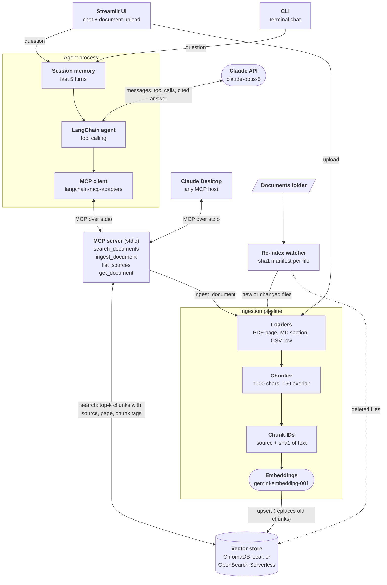

# AI Agent & RAG Automation System

A retrieval-augmented generation (RAG) agent for internal knowledge bases.
It ingests PDFs, Markdown, and CSV files, chunks and embeds them into a
vector store, and answers questions through a conversational Claude agent
that cites the exact passages it used and says so when the documents do
not contain the answer.

Built by [Abdulmajeed Taboo](https://www.linkedin.com/in/abdultaboo/).
Project page: [abdultaboo.netlify.app](https://abdultaboo.netlify.app)

## What it does

- **Ingests** PDF (one document per page), Markdown (one per heading
  section), CSV (one per row), and TXT, keeping page, section, and row
  numbers as metadata.
- **Chunks** with LangChain's `RecursiveCharacterTextSplitter`
  (1000 characters, 150 overlap).
- **Embeds** with Google `gemini-embedding-001` into a vector store:
  local ChromaDB by default, or an **AWS OpenSearch Serverless** vector
  collection with `VECTOR_BACKEND=opensearch`.
- **Answers** through a LangChain tool-calling agent on the **Claude API**
  (`claude-opus-5` by default, set with `AGENT_MODEL`).
- **Cites** every claim with `[source: file, page N]` tags, shown in the UI
  as chips built from what retrieval actually returned.
- **Remembers** the last 5 turns per session for follow-up questions.
- **Uploads** new documents from the Streamlit sidebar.
- **Re-indexes automatically**: a watcher re-ingests new or edited files
  and removes deleted ones, without re-embedding unchanged files.

---

## Architecture


The same diagram as Mermaid source (also in
[`docs/architecture.mmd`](docs/architecture.mmd)).

> Build status: the MCP server and MCP client shown here are being added in
> the next commit. Until then the agent calls the same tools in-process.



**Request path.** A question goes into the session (which adds the last 5
turns), then to the LangChain agent. The agent sends the conversation and
its tool list to Claude. When Claude asks for a tool, the agent's MCP client
calls the MCP server, which embeds the query, pulls the top 4 chunks from
the vector store, and returns them with their citation tags. Claude writes
the answer from those passages only, with inline source tags, and the UI
turns the tags into citation chips.

**Ingestion path.** Uploads, the `ingest_document` MCP tool, and the
re-index watcher all call the same `ingest_file` function: load, chunk,
hash, embed, and upsert. Before upserting, the file's old chunks are deleted
so an edited document can never be cited in its old form.

---

## Design decisions

### Why this vector store

The code talks to one small interface (`add_chunks`, `similarity_search`,
`list_sources`, `get_source_chunks`, `delete_source`, `reset_store` in
[`src/vectorstore/store.py`](src/vectorstore/store.py)) with two backends
behind it:

- **ChromaDB** for local development and the demo: no infrastructure, no
  cost, one folder on disk.
- **AWS OpenSearch Serverless** for an AWS deployment
  ([`opensearch_backend.py`](src/vectorstore/opensearch_backend.py)):
  managed, IAM-authenticated (SigV4), no cluster to size, and it combines
  k-NN vector search with metadata filters and keyword search in one engine,
  which is the path to hybrid retrieval later. It targets **NextGen**
  vector collections, which accept our own document IDs (so re-ingestion
  stays idempotent) and scale to zero when idle.

Tradeoffs considered: pgvector on RDS is cheaper at small scale but is a
database you run and tune yourself; Pinecone is simple but lives outside
the AWS account and its IAM controls; Bedrock Knowledge Bases hides chunking
and citation metadata that this project wants to control. OpenSearch
Serverless Classic collections also bill a minimum OCU floor even when idle
(see the cost model), which is why the demo runs on Chroma.

### Chunk size and overlap

Loaders split on document structure first (PDF page, Markdown heading, CSV
row), so most chunks are one complete section. Only sections longer than
1000 characters (about 250 tokens) are split further, preferring paragraph,
then line, then sentence boundaries. On the sample documents this gives 42
chunks averaging about 370 characters.

- **1000 characters** keeps each passage about one idea, so the top 4
  results are precise and the retrieved context stays near 1,000 tokens per
  search, which keeps Claude input cost low.
- **150 characters of overlap (15%)** means a sentence that straddles a
  split point still appears whole in at least one chunk.
- Tradeoff: small chunks can lose surrounding context. For questions about
  a whole document the agent has a `get_document` tool that returns every
  chunk of one file in order.

### How citations stay tied to source passages

1. Metadata is attached at load time (file name, page, section heading,
   row) and copied onto every chunk along with a `chunk_index`.
2. It is stored next to the vector, so every search hit comes back with it.
3. The retriever prints each passage under a header such as
   `[source=it_password_reset.pdf, page=2, chunk=4]`, so the model sees
   exactly which file and page each sentence came from.
4. The system prompt requires an inline `[source: ...]` tag per claim,
   forbids citing anything not retrieved in the current turn, and requires
   "I couldn't find that in the company knowledge base" when retrieval is
   empty.
5. The UI builds citation chips by parsing the **tool output**, not the
   model's prose, so a chip always points at a passage that was actually
   retrieved.
6. Chunk IDs are `source::sha1(text)`, and re-ingesting a file deletes its
   old chunks first, so no citation can point at text that has since
   changed.

Remaining risk: the model can still attach a tag to the wrong retrieved
passage. `scripts/evaluate.py` scores faithfulness with an LLM judge to
measure this. Claude's native Citations feature (document blocks with
character-level spans) is the next step if stricter guarantees are needed.

### Other tradeoffs

- **An agent instead of a fixed retrieve-then-answer chain.** Claude picks
  between search, listing documents, and reading a whole document. This
  handles "what documents do you have?" and summaries well, but costs one
  extra model round trip per tool call.
- **Sliding-window memory (5 turns)** keeps follow-ups like "what if that
  doesn't work?" working while capping input tokens per question.
- **Gemini embeddings on the free tier** cost nothing but are limited to
  100 embedding requests per minute, which caps how fast large uploads can
  be indexed. A paid tier or a different embedding model removes the limit.

---

## Quickstart

```bash
git clone https://github.com/Majody21/rag-agent-system.git
cd rag-agent-system
python -m venv .venv
# Windows: .venv\Scripts\activate    macOS/Linux: source .venv/bin/activate
pip install -r requirements.txt
cp .env.example .env    # then add ANTHROPIC_API_KEY and GOOGLE_API_KEY
```

Ingest the sample documents and ask questions:

```bash
python scripts/ingest.py --src data/sample_docs
python -m app.cli                      # terminal chat
streamlit run app/streamlit_app.py     # web UI with upload
```

Automated re-indexing (watches a folder, re-indexes only what changed):

```bash
python scripts/reindex.py --src data/sample_docs --watch --interval 30
```

Full rebuild after changing the embedding model or chunk size:

```bash
python scripts/reindex.py --src data/sample_docs --full --yes
```

### Using AWS OpenSearch Serverless instead of Chroma

1. In the AWS console, create a **vector search** collection with Express
   Create (NextGen). Give your IAM user or role a data access policy for
   the collection.
2. `pip install -r requirements-aws.txt` and run `aws configure` (keys stay
   in `~/.aws`, never in this repo).
3. In `.env` set `VECTOR_BACKEND=opensearch`,
   `OPENSEARCH_ENDPOINT=https://<id>.<region>.aoss.amazonaws.com`, and
   `AWS_REGION`.
4. Run `python scripts/ingest.py --src data/sample_docs`. The index and
   its k-NN mapping are created on first write.

Status: the OpenSearch adapter is covered by offline tests against a fake
client (`tests/test_opensearch_backend.py`). It has not yet been run against
a live AWS collection.

## Tests

```bash
pytest -m "not live"   # offline: fake embeddings, no keys, no network
pytest -m live         # real Claude + embeddings, uses a temp store
```

## Evaluation

```bash
python scripts/evaluate.py
```

Runs the agent on 12 question and answer pairs in `eval/qa_pairs.json` and
scores each answer with a Claude judge for faithfulness (grounded in the
retrieved sources) and relevance.

## Project layout

```
rag-agent-system/
├── config.py                  # all settings, read from .env
├── src/
│   ├── ingestion/             # loaders + chunker
│   ├── vectorstore/           # store facade, Chroma + OpenSearch backends
│   ├── retrieval/             # retriever + citation formatter
│   ├── agent/                 # Claude agent, tools, prompt, Session
│   └── pipeline.py            # ingest_file, ingest_directory, sync_directory
├── app/                       # Streamlit UI and CLI
├── scripts/                   # ingest, reindex (--watch), evaluate
├── docs/                      # architecture diagram (.mmd + .svg)
├── data/sample_docs/          # 4 fictional company documents
├── eval/qa_pairs.json
└── tests/
```

## Contact

Abdulmajeed Taboo · [LinkedIn](https://www.linkedin.com/in/abdultaboo/) ·
[Portfolio](https://abdultaboo.netlify.app)
